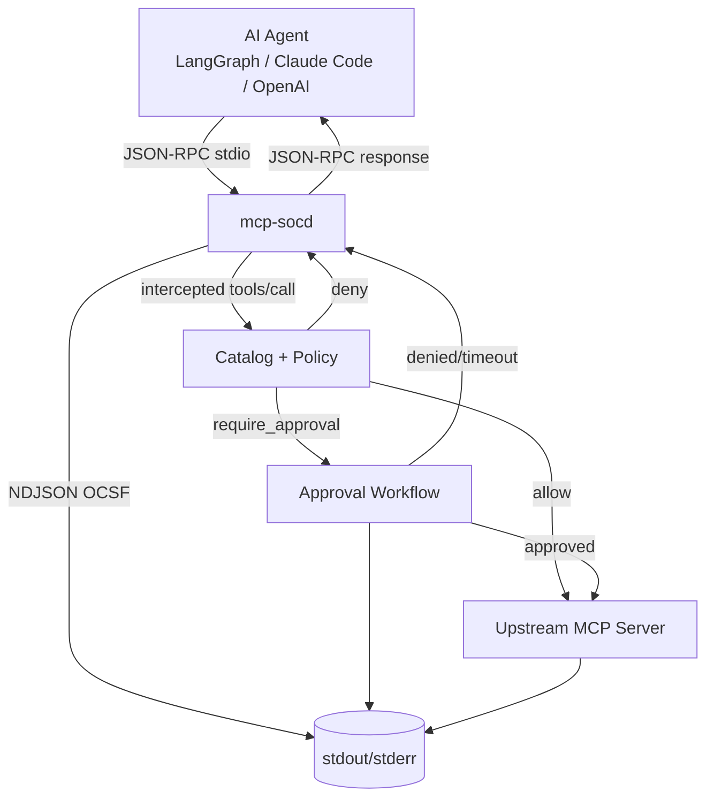

## Summary

`mcp-socd` is an MCP-aware stdio proxy that mediates AI agent tool calls against a starter SOC-action catalog with CrowdStrike Falcon as the v1 backend. Default-denies destructive verbs, requires out-of-band approval for high-blast-radius actions, and emits OCSF Detection Finding audit records. Single static binary, Go 1.23+, framework-agnostic — LangGraph, Claude Code, OpenAI Agents SDK, and MCP servers integrate via standard client config with no agent code changes.

## Problem Frame

Detection/security engineers run personal AI agents (LangGraph, Claude Code, OpenAI Agents SDK) against their own SIEM (Splunk, Elastic, Sentinel) and EDR tenants (CrowdStrike Falcon). The pattern is now common enough that enterprise SOC teams have agents deployed in production that nobody fully trusts — and the failure mode is concrete: agents taking destructive actions on production because no production-vs-dev boundary is enforced at the action layer. Recent incidents (Replit/Lemkin Jul 2025, Cursor/Claude/PocketOS Apr 2026) deleted production databases in seconds by chaining unrelated overprivileged tokens. Output guardrails, observability platforms, and framework HITL primitives do not solve this — the gap is at the action-execution layer, where no OSS solution ships a SOC-action catalog plus typed policy plus audit shape designed for SIEM ingestion. See origin document for the full problem frame and actor/flow/requirement inventory.

## Requirements

### Configuration and posture

- R1. The proxy default-denies every tool call whose action type and target are not explicitly allowlisted.
- R2. The proxy supports per-action allowlists keyed by action type and target, configurable without recompilation and hot-reloadable via SIGHUP.
- R3. When the proxy errors during tool-call evaluation, it fails closed for destructive actions and fails open for read actions.

### SOC-action catalog

- R4. The proxy ships with a starter SOC-action catalog covering `isolate_endpoint`, `block_user_account`, `rotate_api_key`, `submit_edr_query`, and `enrich_ioc`.
- R5. Each catalog action declares typed parameters, a blast-radius score, and an OCSF Detection Finding (UID 2004) audit shape.
- R6. The catalog is extensible through configuration; adding or modifying actions does not require recompilation.

### Destructive-verb gate

- R7. The proxy intercepts destructive verbs (`delete`, `drop`, `truncate`, `revoke`, `disable`, `wipe`, `purge`) regardless of catalog membership.
- R8. A destructive-verb interception requires out-of-band approval through a configured channel before execution.

### MCP integration

- R9. The proxy functions as an MCP-aware stdio proxy mediating tool calls between an agent and an upstream MCP server.
- R10. The proxy works with LangGraph, Claude Code, OpenAI Agents SDK, and MCP servers without agent code modification.

### Backend integration (v1)

- R11. The proxy integrates with CrowdStrike Falcon as the v1 backend for `isolate_endpoint`, `block_user_account`, and `submit_edr_query` actions.

### Approval workflow

- R12. The proxy supports terminal prompt and Slack DM as approval channels for v1.
- R13. The approval workflow records the approver identity and the approval timestamp in the OCSF audit record.

### Audit

- R14. The proxy emits audit records as JSON-lines to stdout (with `--audit-stdout` opt-in; default is stderr) in OCSF format.
- R15. Each audit record includes agent identity, action type, parameters, blast-radius score, decision, approver identity when applicable, policy version, and timestamp.

## Key Technical Decisions

- **KTD1. Language: Go 1.23+.** Single static binary via `CGO_ENABLED=0 go build` is trivially achieved. The official `modelcontextprotocol/go-sdk` is production-ready, and `crowdstrike/gofalcon`, `slack-go/slack`, `gobwas/glob`, `fsnotify/fsnotify` all have usable Go libraries. The goroutine model maps 1:1 to proxy concurrency (one goroutine per upstream connection, per downstream, per in-flight tool call). Rust was rejected because no first-party OCSF or CrowdStrike SDK exists in Rust — hand-rolling both would double the implementation cost with no clear benefit.
- **KTD2. Architecture: stdio wrapper proxy.** The proxy is invoked as `mcp-socd -- <upstream-mcp-server-cmd>` and inherits the wrapped server's stdio. Every newline-delimited JSON-RPC frame is parsed and inspected before forwarding. This is the position with full wire visibility, no agent code changes, and no MCP SDK ownership — `sparfenyuk/mcp-proxy` (~2.6k stars) and `interactive-inc/open-mcp-guardrails` validate the pattern. Streamable HTTP transport deferred to v1.1.
- **KTD3. Policy engine: in-memory data structure plus `gobwas/glob`.** Rules are compiled once at load time into a slice of `*CompiledRule` matched first-match-wins by specificity (exact > glob > catch-all). Glob matching via `gobwas/glob` (significantly faster than stdlib regex per its benchmarks). OPA and Cedar are rejected for v1 — a single-engineer personal proxy has no principal/RBAC complexity that would justify a full policy language.
- **KTD4. OCSF event class: Detection Finding (UID 2004) with custom verdict semantics.** Security Finding (UID 2001) was deprecated in OCSF v1.1.0 in favor of the specific findings classes. Detection Finding's `verdict` / `verdict_id` fields are extended with `verdict_id` ∈ {5 Policy Allow, 6 Policy Deny, 7 Awaiting Approval, 8 Approved, 9 Timed Out} as vendor-specific values; `activity_id = 99 (Other)` with `activity_name = "Policy Decision"` carries the audit event itself.
- **KTD5. Audit emission: hand-rolled JSON with explicit flush.** No Go OCSF library has meaningful production adoption; `valllabh/ocsf-schema-golang` (12 stars) is the closest but pre-1.0. Hand-rolled struct literal plus `encoding/json` is honest and short. Every audit write calls `bufio.Writer.Flush()` because Go's `os.Stdout` is block-buffered when piped (up to 4 KB before the consumer sees anything). SIEM-friendly JSON-lines to stdout is opt-in (`--audit-stdout`); the default is stderr so the proxy remains a spec-compliant MCP server.
- **KTD6. Configuration format: YAML, XDG Base Directory.** Config path follows XDG via `adrg/xdg` (Linux/macOS/Windows). Hot-reload via SIGHUP. A failed reload keeps the last good policy in memory; the proxy never fails open. Audit file path configurable, with `O_DIRECT` semantics where the OS supports it.
- **KTD7. Approval channels: terminal prompt plus Slack DM.** Terminal reads from `/dev/tty` explicitly (survives `nohup`/`tmux`/piped stdin). Slack uses `slack-go/slack` with Socket Mode for self-contained operation (no public webhook URL needed); interactive Block Kit buttons for Approve/Deny; signing-secret verification with a 5-minute replay window. Fallback when no TTY and no Slack configured is deny.
- **KTD8. Approval SLA: 300s default, configurable per-rule, fallback deny.** No answer means no destructive action. The approval token is bound to the original request fields via HMAC to prevent replay across requests. Approver identity is recorded in audit: Slack user ID plus resolved email; terminal `$USER` plus controlling terminal UID.

## High-Level Technical Design

### Architecture



### Tool-call flow (directional, not implementation)

```
agent → proxy: tools/call {name, arguments}
proxy:
  1. parse JSON-RPC frame; non-JSON-RPC frames passthrough
  2. if tools/list: filter results against policy, hide disallowed tools
  3. if tools/call:
     a. validate arguments against tool's inputSchema (reject malformed)
     b. evaluate policy: rule_match(action_name) -> {allow, deny, require_approval}
     c. if require_approval or destructive-verb detected:
        - emit OCSF event {verdict_id = Awaiting Approval}
        - request approval via configured channel(s)
        - on denial/timeout: emit OCSF {verdict_id = Policy Deny}, return JSON-RPC error
     d. if allow: forward to upstream
     e. forward response, emit OCSF {verdict_id = Policy Allow}
  4. flush audit buffer (every line, every event)
  5. forward response to agent
```

### OCSF Detection Finding (UID 2004) emission shape

```json
{
  "metadata": { "version": "1.4.0", "product": { "name": "mcp-socd" } },
  "class_name": "Detection Finding",
  "class_uid": 2004,
  "category_uid": 2,
  "type_uid": 200499,
  "activity_id": 99,
  "activity_name": "Policy Decision",
  "time": 1749859200000,
  "severity_id": 4,
  "finding_info": {
    "uid": "<policy_rule_id>",
    "title": "isolate_endpoint against server99.example.com",
    "types": ["policy-violation", "soc-action"]
  },
  "verdict": "Policy Allow",
  "verdict_id": 5,
  "status": "Success",
  "status_id": 1,
  "actor": { "user": { "name": "agent-user@home" } },
  "resources": [{ "type": "MCP Tool", "name": "isolate_endpoint" }],
  "policy_version": 7,
  "request_id": "uuid-v4"
}
```

`verdict_id` extension values are documented in `docs/audit-schema.md`: 5 Policy Allow, 6 Policy Deny, 7 Awaiting Approval, 8 Approved, 9 Timed Out.

## Implementation Units

### Phase 1: Foundation

#### U1. Project skeleton, CLI, config, signals

- **Goal:** Go module, `cmd/mcp-socd/main.go`, cobra CLI with `--config` / `--audit-stdout` / `--version` flags plus a positional `<upstream-server-cmd>`, XDG-compliant config loader, SIGHUP/SIGTERM/SIGINT handlers. Builds a static binary; `make build` target.
- **Files:**
  - `go.mod`, `go.sum`
  - `cmd/mcp-socd/main.go`
  - `internal/cli/root.go` (cobra)
  - `internal/config/config.go` (types)
  - `internal/config/loader.go` (YAML load)
  - `internal/config/path.go` (XDG path resolution via `adrg/xdg`)
  - `internal/version/version.go`
  - `Makefile` (build, test, lint targets)
  - `.goreleaser.yaml`
- **Patterns:** Standard Go project layout (`cmd/`, `internal/`). `spf13/cobra` for CLI. Config schema versioned (`version: 1`).
- **Test Scenarios:**
  - `TestMain_ParsesConfig` — loads sample `config.yaml` and asserts config struct populated.
  - `TestMain_PassesSignalsThrough` — sends SIGHUP, asserts config reload triggered via a mock loader.
  - `TestConfig_XDGPath` — verifies XDG path resolution on Linux/macOS/Windows.
  - `TestCLI_VersionFlag` — `--version` prints build info.
- **Verification:** `make build` produces `bin/mcp-socd` static binary; `./bin/mcp-socd --version` prints version; `./bin/mcp-socd --config fixtures/sample-config.yaml -- echo hello` echoes "hello" with config loaded.

### Phase 2: Core engine

#### U2. SOC-action catalog types and starter catalog

- **Goal:** Typed catalog (`Action` struct: `Name`, `Description`, `Params []Param`, `BlastRadius int`, `OCSFAuditShape AuditShape`). Starter catalog with the 5 actions from R4. YAML loader for custom actions.
- **Files:**
  - `internal/catalog/types.go` (`Action`, `Param`, `BlastRadius`, `AuditShape`)
  - `internal/catalog/starter.go` (5 starter actions)
  - `internal/catalog/loader.go` (YAML load plus JSON-schema validation)
- **Patterns:** Each catalog action declares its input as JSON-schema (used at runtime to validate arguments). Blast-radius scoring 1-5: 1=read, 2=metadata, 3=soft-action, 4=user-impact, 5=system-impact.
- **Test Scenarios:**
  - `TestStarterCatalog_HasFiveActions` — assert all 5 actions present and correctly typed.
  - `TestCatalog_LoadsCustomAction` — load a user-defined action from YAML and assert types validated.
  - `TestCatalog_RejectsInvalidParams` — argument that fails JSON-schema validation returns structured error.
  - `TestBlastRadius_ScoresAllInRange` — every catalog action's blast-radius is 1-5.
- **Verification:** `internal/catalog/starter.go` exposes a single `Starter() []Action` consumed by U3.

#### U3. Policy engine: allowlist plus destructive-verb gate

- **Goal:** `policy.Engine.Evaluate(call Call) Decision` returns `{Allow, Deny, RequireApproval}`. First-match-wins across rules; catch-all destructive-verb rule covers `delete|drop|truncate|revoke|disable|wipe|purge`. `gobwas/glob` for tool-name matching; exact match for targets.
- **Files:**
  - `internal/policy/engine.go` (`Engine`, `Decision`, `Evaluate`)
  - `internal/policy/rule.go` (`Rule`, `CompiledRule`)
  - `internal/policy/glob.go` (gobwas/glob wrapper)
  - `internal/policy/destructive.go` (verb detection)
  - `internal/policy/policy_test.go`
- **Patterns:** Rules sorted by specificity at load time (exact > glob > catch-all). Destructive-verb check is a separate last-resort rule that always requires approval. Policy swap uses `atomic.Pointer[Policy]` so in-flight evaluations read the same snapshot that ends up in the audit event's `policy_version`.
- **Test Scenarios:**
  - `TestEngine_AllowOnMatch` — exact target match yields Allow.
  - `TestEngine_DenyOnMiss` — no rule matches yields Deny.
  - `TestEngine_DestructiveVerb_AlwaysTriggers` — even with no rule, `delete_*` requires approval.
  - `TestEngine_GlobMatch` — `*.example.com` glob matches `server01.example.com`.
  - `TestEngine_AtomicSwap` — concurrent reads during swap do not deadlock; post-swap reads see new policy.
  - `TestEngine_CatchAllDestructive` — non-catalog tool with `truncate_table` verb is intercepted.
- **Verification:** Policy engine consumed by U4; tested against the 6 acceptance examples from the origin document.

#### U4. MCP stdio proxy with tools/call interception

- **Goal:** JSON-RPC frame loop on stdio. `tools/call` frames evaluated against U3 policy before forwarding. `tools/list` frames filtered against policy (hide disallowed tools from the agent's view as defense-in-depth against prompt injection). Non-JSON-RPC frames passed through unchanged. Subprocess management for upstream MCP server.
- **Files:**
  - `internal/proxy/proxy.go` (main loop)
  - `internal/proxy/interceptor.go` (tools/call handler)
  - `internal/proxy/tools_list.go` (list filter)
  - `internal/proxy/jsonrpc.go` (frame parser)
  - `internal/proxy/subprocess.go` (upstream process lifecycle)
- **Patterns:** Use `modelcontextprotocol/go-sdk` for typed MCP message handling where possible (it abstracts JSON-RPC envelope validation); fall back to hand-rolled JSON-RPC for low-level stdin/stdout framing if the SDK does not expose a stdio-wrapper primitive. Reference: `interactive-inc/open-mcp-guardrails` and `sparfenyuk/mcp-proxy`.
- **Test Scenarios:**
  - `TestProxy_PassesInitialize` — `initialize` and `initialized` notifications pass through unchanged.
  - `TestProxy_InterceptsToolsCall` — `tools/call` is paused for policy evaluation before forwarding.
  - `TestProxy_FiltersToolsList` — disallowed tools hidden from `tools/list` response.
  - `TestProxy_HandlesNotificationsListChanged` — `notifications/tools/list_changed` triggers re-fetch and re-filter.
  - `TestProxy_SubprocessRespawn` — if upstream crashes, proxy emits audit event and refuses new requests.
  - `TestProxy_PreservesStdoutPurity` — only valid MCP frames on stdout (no proxy logs leaked).
- **Verification:** `make test-integration` runs the proxy against a mock upstream MCP server and asserts policy enforcement works.

#### U5. OCSF audit emitter

- **Goal:** OCSF Detection Finding (UID 2004) emitter per KTD4. Buffered writer with explicit flush after every event. Optional stdout emission via `--audit-stdout`. Optional `--audit-log <path>` file sink with fsync every event.
- **Files:**
  - `internal/audit/emitter.go` (`Emitter.Emit(event Event)`)
  - `internal/audit/schema.go` (OCSF Detection Finding struct)
  - `internal/audit/writer.go` (buffered writer with flush plus fsync)
  - `internal/audit/verdict.go` (verdict_id extension)
  - `internal/audit/heartbeat.go` (60s idle heartbeat)
- **Patterns:** Hand-rolled JSON via `encoding/json`. `bufio.Writer` wraps `os.Stdout` with `Flush()` after every `Write`. On SIGTERM, flush + fsync + close. Heartbeat event every 60s when idle so post-hoc analysts can detect a crashed process as a gap-in-stream rather than a silent failure.
- **Test Scenarios:**
  - `TestEmitter_DetectionFindingValid` — emitted JSON validates against OCSF v1.4 schema loaded as a test fixture.
  - `TestEmitter_FlushesAfterEveryEvent` — kill process mid-emit, assert no events lost.
  - `TestEmitter_Heartbeat` — no events for 60s triggers heartbeat.
  - `TestEmitter_VerdictExtension` — verdict_id values 5/6/7/8/9 emitted correctly.
  - `TestEmitter_PolicyVersionStamped` — every event includes current `policy_version`.
- **Verification:** Pipe emitted JSON into `jq` and verify each line is valid OCSF Detection Finding. Run with `--audit-stdout` against a fixture consumer and verify zero buffering loss.

### Phase 3: Workflow

#### U6. Approval workflow

- **Goal:** `approval.Workflow.Request(call Call, channels []Channel) Result`. Channels registered at startup; first-success wins; all failures recorded in audit. 300s default timeout (configurable per-rule). HMAC-bound one-time approval token to prevent replay.
- **Files:**
  - `internal/approval/workflow.go` (`Workflow`, `Request`, `Result`)
  - `internal/approval/token.go` (HMAC-bound request token)
  - `internal/approval/channel.go` (`Channel` interface)
- **Patterns:** `Channel` interface so terminal, Slack, and future PagerDuty channels share the same shape. Token HMAC signs `(request_id, action_name, target, agent_identity, expires_at)` with a process-local key; signature stored in audit alongside the request.
- **Test Scenarios:**
  - `TestWorkflow_TerminalApprove` — approve within timeout returns allow.
  - `TestWorkflow_TerminalDeny` — explicit deny returns deny with approver identity.
  - `TestWorkflow_TimeoutFallback` — 300s elapses; `Result.Deny` with reason `timeout`.
  - `TestWorkflow_TokenReplayRejected` — same token presented twice is rejected with audit event.
  - `TestWorkflow_ChannelFailover` — terminal unavailable, Slack configured; Slack becomes primary.
- **Verification:** Run proxy against a mock MCP server that calls `delete_database`; observe approval prompt, deny, audit record reflects approver identity and decision.

#### U7. Slack DM approval channel

- **Goal:** `Channel` implementation using `slack-go/slack`. Socket Mode for self-contained operation. Block Kit interactive Approve/Deny buttons. Signing-secret verification with a 5-minute replay window.
- **Files:**
  - `internal/approval/slack.go` (`SlackChannel` implementing `Channel`)
  - `internal/approval/slack_verify.go` (HMAC signing-secret verification)
- **Patterns:** Socket Mode requires an `app_token` (xapp-...) and `bot_token` (xoxb-...). Block Kit `actions` block with `action_id` = `mcp-socd.approve` / `mcp-socd.deny`. Resolve approver user ID to email via `users.info` for audit.
- **Test Scenarios:**
  - `TestSlack_OpensDMChannel` — `conversations.open` returns expected channel ID.
  - `TestSlack_PostsBlockKitMessage` — message contains action buttons.
  - `TestSlack_ReceivesApproval` — simulated `block_actions` payload yields approval result.
  - `TestSlack_RejectsUnsignedPayload` — payload without valid signature is rejected with audit.
  - `TestSlack_RejectsExpiredTimestamp` — payload timestamp older than 5min is rejected.
- **Verification:** Manual: configure test workspace, run proxy, approve/deny in Slack, verify audit. Integration test uses a recorded Block Kit payload fixture.

#### U8. CrowdStrike Falcon backend

- **Goal:** `backend.Backend` interface implementation backed by `crowdstrike/gofalcon`. Implements `isolate_endpoint`, `block_user_account`, `rotate_api_key`, `submit_edr_query`, and `enrich_ioc` actions. OAuth2 client credentials with token caching.
- **Files:**
  - `internal/backend/backend.go` (interface)
  - `internal/backend/registry.go` (backend registration by name)
  - `internal/backend/falcon/client.go` (OAuth2 token cache, base URL per cloud)
  - `internal/backend/falcon/hosts.go` (`isolate_endpoint`, `lift_isolation`)
  - `internal/backend/falcon/users.go` (`block_user_account`, `unblock`)
  - `internal/backend/falcon/api_keys.go` (`rotate_api_key`)
  - `internal/backend/falcon/rtr.go` (`submit_edr_query`)
  - `internal/backend/falcon/iocs.go` (`enrich_ioc`)
- **Patterns:** `gofalcon/testing` package for unit tests with `falcon/testing.NewClient(...)`. Token refresh handled by SDK; do not implement custom retry. Per-cloud base URL selection from config.
- **Test Scenarios:**
  - `TestFalcon_IsolateEndpoint_Success` — happy path against `falcon/testing` fake.
  - `TestFalcon_IsolateEndpoint_AuthFailure` — invalid credentials return 401 surfaced with structured error.
  - `TestFalcon_RateLimited` — 429 with retry-after triggers backoff and retry (or surfaces error if exhausted).
  - `TestFalcon_RTRTimeout` — long-running RTR session times out gracefully and is audited.
  - `TestFalcon_AllFiveActionsRegistered` — every starter catalog action has a working backend implementation.
- **Verification:** Integration test against a CrowdStrike Falcon sandbox tenant with explicit teardown (unisolate after each test).

### Phase 4: Reliability

#### U9. Error handling posture (fail-closed / fail-open)

- **Goal:** `errors.Posture(classify Call) Mode` returns `FailClosed` for destructive actions (catalog blast-radius ≥ 3 OR destructive-verb match) and `FailOpen` for read actions (blast-radius < 3 AND no destructive verb). Used by U4 to decide what to do when U5 or U8 errors.
- **Files:**
  - `internal/errors/posture.go` (`Posture`, `Mode`)
  - `internal/errors/posture_test.go`
- **Patterns:** Mode selection happens once per `tools/call` evaluation; the mode is included in the OCSF event's `metadata` so post-hoc analysis can correlate. Default posture is fail-closed for destructive, fail-open for read; configurable per-rule.
- **Test Scenarios:**
  - `TestPosture_DestructiveFailsClosed` — error during `isolate_endpoint` evaluation blocks the action; audit `decision=error reason=fail_closed`.
  - `TestPosture_ReadFailsOpen` — error during `submit_edr_query` evaluation attempts the action in degraded mode; audit `decision=error reason=fail_open`.
  - `TestPosture_ModeStampedInAudit` — every error audit event includes posture mode.
- **Verification:** Inject backend timeout via mock; verify AE5 (fail-closed destructive) and AE6 (fail-open read) from the origin document.

#### U10. Framework integration tests (LangGraph, Claude Code, OpenAI Agents)

- **Goal:** End-to-end tests demonstrating `mcp-socd` integrates with all three frameworks (R10) without agent code modification. Each test runs the proxy against a mock upstream MCP server and exercises one action per framework.
- **Files:**
  - `test/integration/langgraph_test.go` (Python subprocess invoking LangGraph)
  - `test/integration/claude_code_test.go` (Claude Code CLI subprocess)
  - `test/integration/openai_agents_test.go` (Python subprocess invoking OpenAI Agents SDK)
  - `test/integration/framework_test.go` (shared mock upstream server in Go)
- **Patterns:** Mock upstream MCP server implements the 5 starter actions as no-ops with structured responses. Each framework test starts `mcp-socd` wrapping the mock, starts the agent, instructs the agent to call one allowed and one disallowed action, then asserts policy enforcement plus audit records.
- **Test Scenarios:**
  - `TestLangGraph_AllowAllowedAction` — agent issues `submit_edr_query`; proxy allows; result returned.
  - `TestLangGraph_DenyDisallowedAction` — agent issues `isolate_endpoint` against a non-allowlisted host; proxy denies; agent receives error.
  - `TestClaudeCode_AllowAllowedAction` — same shape for Claude Code CLI.
  - `TestClaudeCode_ApprovalRequired` — Claude Code CLI invocation triggers approval prompt in the configured channel.
  - `TestOpenAIAgents_AllowAllowedAction` — same shape for OpenAI Agents SDK.
- **Verification:** `make test-integration` runs all three framework tests against the mock upstream; passes within 5 minutes.

#### U11. Distribution

- **Goal:** GoReleaser pipeline producing single static binaries for `linux`/`darwin`/`windows` × `amd64`/`arm64`, Homebrew tap, Scoop bucket, static tarball with sha256 checksums. GitHub Actions workflow for release.
- **Files:**
  - `.goreleaser.yaml`
  - `.github/workflows/release.yml`
  - `packaging/homebrew/mcp-socd.rb` (generated by GoReleaser at release time)
  - `packaging/scoop/mcp-socd.json` (generated by GoReleaser)
  - `scripts/install.sh` (curl-pipe-sh install helper for Linux/macOS)
- **Patterns:** `CGO_ENABLED=0`; `linux/musl` variant for Alpine compatibility; `-trimpath -ldflags='-s -w'`; version info injected via `ldflags` and a `main.version` package variable.
- **Test Scenarios:**
  - `TestRelease_BuildsAllPlatforms` — `goreleaser build --snapshot --clean` produces all 6 binaries.
  - `TestRelease_HomebrewFormulaValid` — generated formula parses with `brew audit --strict`.
  - `TestRelease_BinarySizeUnderThreshold` — each binary is under 30 MB.
- **Verification:** Tag a release; GoReleaser runs; binaries, checksums, Homebrew tap PR, and Scoop manifest are all published.

## Scope Boundaries

### Deferred for later (v1.1+)

- Carbon Black, Sentinel One, Microsoft Defender backends — CrowdStrike proves the abstraction first.
- Streamable HTTP transport support — stdio is the v1 transport.
- Agent-identity attestation (SPIFFE bridge) — separate surface.
- K8s-native controller / admission webhook — v1 covers homelab and direct deployment.
- PagerDuty approval channel — after Slack workflow is proven.
- Multi-agent orchestration — single-agent proxy model only.
- Policy engine adapter (OPA, Cedar, OpenFGA) — lower differentiation, higher cost.

### Outside this product's identity

- LLM-output guardrails (Lakera, Guardrails AI, NeMo Guardrails). The proxy mediates tool-call execution; it does not inspect model output.
- LLM observability (Langfuse, LangSmith, Helicone). The proxy emits audit records; it does not trace prompt chains.
- SOAR workflow builder (Tines, XSOAR, Torq). The proxy constrains tool calls; it does not orchestrate multi-step investigations.
- Agent framework itself (LangGraph, AutoGen, CrewAI, Claude Code). The proxy sits beside the framework as a proxy.

## Risks & Dependencies

- **R1. gofalcon pre-1.0 stability.** `crowdstrike/gofalcon` v0.21.0 is community-blessed but pre-1.0; minor-version bumps have occasionally added required params. Mitigation: pin tightly in `go.mod`, read changelogs on bump, integration test U8 fails loudly on API drift.
- **R2. OCSF Go library immaturity.** `valllabh/ocsf-schema-golang` (12 stars) and `hstern/go-ocsf` (pre-1.0) have minimal production adoption. Mitigation: hand-rolled JSON per KTD5; CI validates emitted events against OCSF JSON Schema fixtures.
- **R3. MCP spec churn.** Spec moves roughly twice a year; pin `MCP-Protocol-Version` in streamable-HTTP mode (when added in v1.1). Mitigation: pin SDK version, track spec changelog quarterly.
- **R4. SIEM-side OCSF variance.** Splunk, Elastic, and Sentinel have different OCSF ingestion quirks. Mitigation: emit pure spec-compliant Detection Finding per KTD4; document field semantics in `docs/audit-schema.md` so SIEM admins can map fields once.
- **R5. Slack signing-secret distribution.** Socket Mode tokens are long-lived; compromise means full approval-channel takeover. Mitigation: document token rotation in README, refuse to start if `--slack-bot-token` looks like a personal OAuth token, log every approval with the full Slack payload for audit.
- **R6. CrowdStrike API rate limits.** ~6000 req / 10 min per API client. A bursty agent could exhaust quota. Mitigation: SDK-level backoff (already in `gofalcon`); audit `error_reason=rate_limited` so the detection engineer can scale up Falcon API clients.
- **R7. Approval timeout vs. operational latency.** 300s default may be too short for after-hours solo on-call. Mitigation: configurable per-rule; document the trade-off; default to 300s but make it loud.

## Documentation / Operational Notes

- `README.md` — install (Homebrew, Scoop, curl-pipe-sh), quickstart with LangGraph, configuration reference, troubleshooting.
- `docs/audit-schema.md` — every OCSF field documented with sample values; target audience is the SIEM admin mapping mcp-socd events into their detection rules.
- `docs/policy-schema.md` — full `policy.yaml` reference with every action modifier documented.
- `docs/security-model.md` — what the proxy protects against and what it does not; explicit non-goals (does not protect against a malicious agent deliberately bypassing policy; does not protect against an attacker with shell on the proxy host).
- `docs/troubleshooting.md` — common error scenarios (Falcon auth failure, Slack signature failure, policy reload rejection) with diagnostic commands.

## Acceptance Examples (carried from origin document)

- AE1. Read action with allowlist match — R1, R2, R4, R9, R11, R14, R15 covered by U3 + U4 + U5 + U8.
- AE2. Read action with allowlist miss — R1, R2, R4, R9, R14, R15 covered by U3 + U4 + U5.
- AE3. Destructive action with allowlist match and approval — R2, R4, R5, R7, R8, R9, R11, R12, R13, R14, R15 covered by U3 + U4 + U5 + U6 + U7 + U8.
- AE4. Destructive-verb gate triggered outside catalog — R7, R8 covered by U3 (catch-all destructive rule).
- AE5. Proxy fails-closed on destructive action — R3, R14, R15 covered by U5 + U9.
- AE6. Proxy fails-open on read action — R3, R14, R15 covered by U5 + U9.

## Sources / Research

- MCP Architecture & Transports: <https://modelcontextprotocol.io/specification/2025-06-18/basic/transports>
- MCP Security Best Practices: <https://modelcontextprotocol.io/specification/2025-06-18/basic/security_best_practices>
- MCP Go SDK: `github.com/modelcontextprotocol/go-sdk` v1.6.1, Apache-2.0
- CrowdStrike Falcon Go SDK: `github.com/crowdstrike/gofalcon` v0.21.0, MIT — has built-in `falcon/testing` fake client
- OCSF Schema: `github.com/ocsf/ocsf-schema` v1.8.0, Apache-2.0; class UID 2004 Detection Finding at <https://schema.ocsf.io/classes/detection_finding>
- Slack Go SDK: `github.com/slack-go/slack` v0.26.0, BSD-2-Clause
- GoReleaser: <https://goreleaser.com/customization/build/> and <https://goreleaser.com/customization/homebrew/>
- XDG Base Directory (Go): `github.com/adrg/xdg`
- Glob: `github.com/gobwas/glob` — production-grade, faster than stdlib regex per benchmarks
- File watcher: `github.com/fsnotify/fsnotify`
- Hot-reload signal conventions: nginx `SIGHUP`, osquery `SIGHUP`, Falco `SIGUSR1` plus `watch_config_files`
- Origin document: `docs/brainstorms/2026-06-20-ai-agent-containment-soc-requirements.md` — full problem frame, actors A1-A7, flows F1-F5, requirements R1-R15, success criteria SC1-SC5